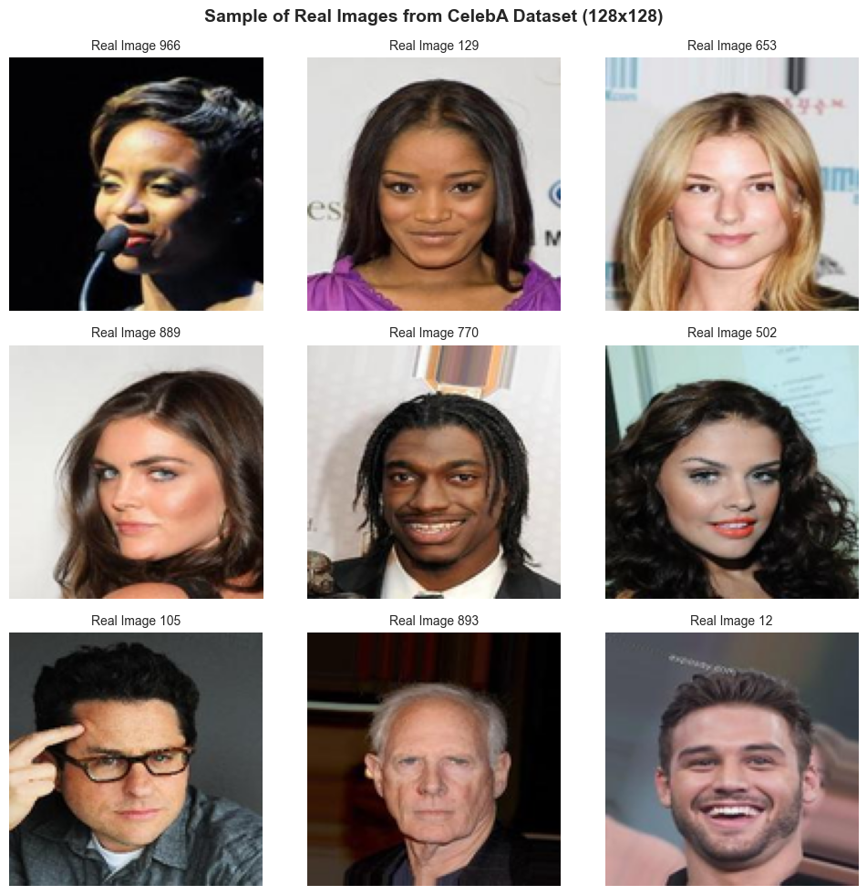
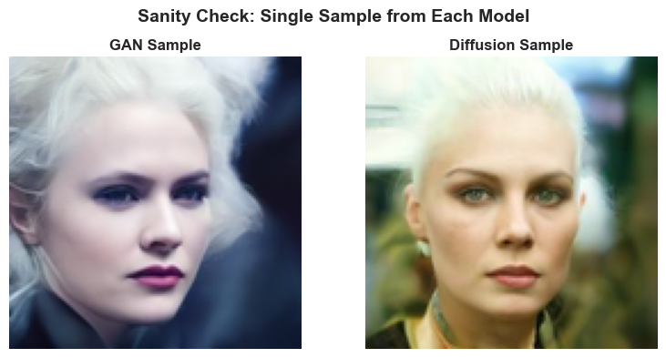
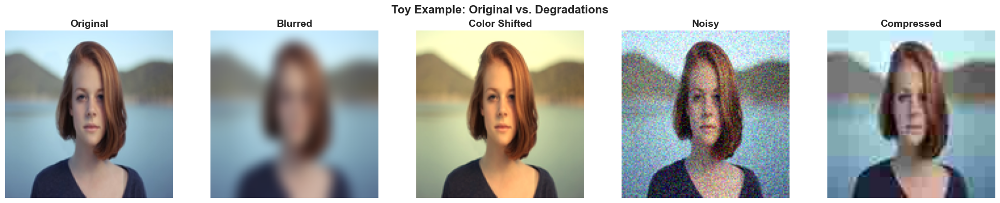
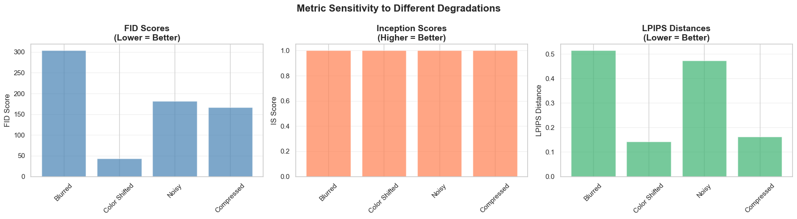
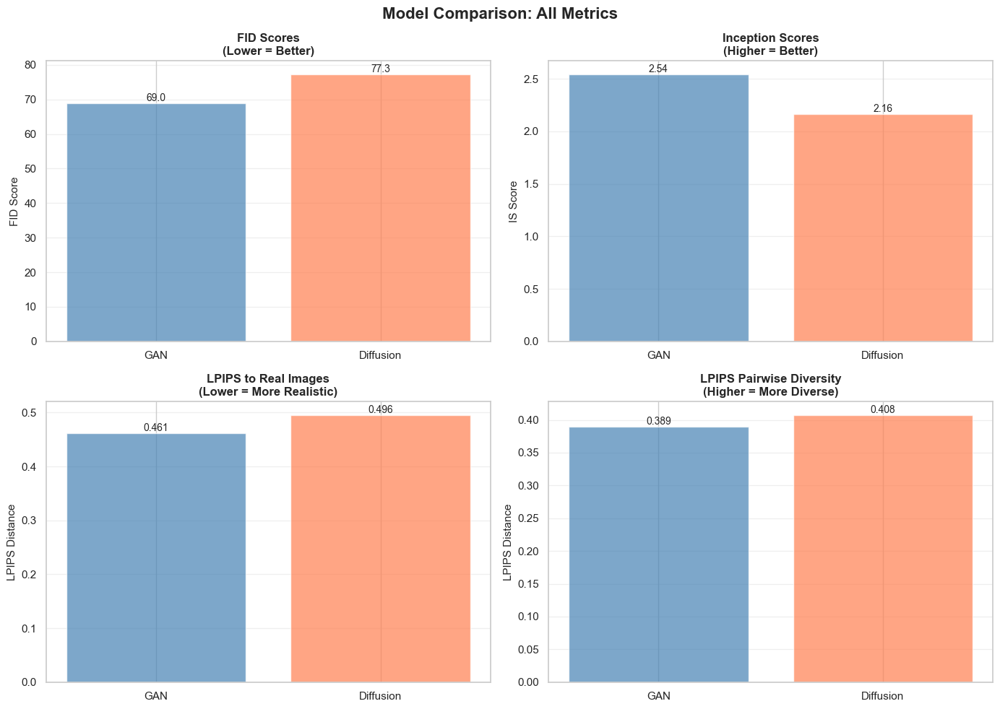

# Initialization

## Load Packages


```python
import os
import random
from pathlib import Path
from typing import Dict, List, Tuple
import warnings
warnings.filterwarnings('ignore')

from tqdm import tqdm

import numpy as np
import pandas as pd
import matplotlib.pyplot as plt
import seaborn as sns
from PIL import Image
import torch
import torchvision.transforms as T
from dotenv import load_dotenv

from datasets import load_dataset
from torchvision.utils import save_image

from diffusers import DDPMPipeline, AutoencoderKL
from transformers import pipeline
import torch.nn.functional as F

# Set modern seaborn theme
sns.set_theme(style="whitegrid", palette="husl")
plt.rcParams['figure.figsize'] = (12, 8)
plt.rcParams['figure.dpi'] = 100
```

## Configuration and Environments


```python
load_dotenv()

# Configuration parameters
CONFIG = {
    'project_name': 'synthetic_image_eval',
    'seed': 42,
    'n_real_images': 1000,  # Parameterized for easy adjustment
    'n_generated_per_model': 500,
    'image_size': 128,  # Using 128x128 for better quality evaluation
    'data_dir': os.getenv('DATA_DIR', './data'),  # From .env file
    'batch_size': 16,
}

# Create project directory structure
PROJECT_DIR = Path(CONFIG['data_dir']) / CONFIG['project_name']
DIRS = {
    'real': PROJECT_DIR / 'real_images',
    'gan': PROJECT_DIR / 'gan_generated',
    'diffusion': PROJECT_DIR / 'diffusion_generated',
    'toy': PROJECT_DIR / 'toy_example',
}

for dir_path in DIRS.values():
    dir_path.mkdir(parents=True, exist_ok=True)

```

## Reproducibility Setup


```python
def set_seed(seed: int = 42):
    """Set random seeds for reproducibility across all libraries."""
    random.seed(seed)
    np.random.seed(seed)
    torch.manual_seed(seed)
    torch.cuda.manual_seed_all(seed)
    torch.backends.cudnn.deterministic = True
    torch.backends.cudnn.benchmark = False

set_seed(CONFIG['seed'])
print(f"✓ Random seed set to {CONFIG['seed']}")
```

    ✓ Random seed set to 42


## Device Config


```python
device = 'mps' if torch.backends.mps.is_available() else 'cuda' if torch.cuda.is_available() else 'cpu'
print(f"✓ Using device: {device}")
```

    ✓ Using device: mps


## Utility Functions


```python
def clean_directory(dir_path: Path, pattern: str = "*"):
    """
    Clean a directory by removing all files matching the pattern.
    Useful for ensuring fresh runs without stale cached images.
    
    Args:
        dir_path: Directory to clean
        pattern: File pattern to match (default: all files)
    """
    if dir_path.exists():
        files = list(dir_path.glob(pattern))
        if files:
            print(f"  Cleaning {len(files)} files from {dir_path.name}/")
            for file in files:
                file.unlink()
            return len(files)
    return 0

def save_image_grid(images: List[Image.Image], save_path: Path, nrow: int = 3):
    """Save a grid of images for visualization."""
    n = len(images)
    ncol = (n + nrow - 1) // nrow
    
    fig, axes = plt.subplots(ncol, nrow, figsize=(nrow * 3, ncol * 3))
    axes = axes.flatten() if n > 1 else [axes]
    
    for idx, (img, ax) in enumerate(zip(images, axes)):
        ax.imshow(img)
        ax.axis('off')
    
    for ax in axes[n:]:
        ax.axis('off')
    
    plt.tight_layout()
    plt.savefig(save_path, bbox_inches='tight', dpi=150)
    plt.close()
```

# Dataset Preparation

## Load CelebA-HQ Dataset


```python
try:
    dataset = load_dataset("nielsr/CelebA-faces", split="train", trust_remote_code=True)
    print(f"✓ Dataset loaded successfully")
    print(f"  Total images available: {len(dataset)}")
    print(f"  Native resolution: 178x178 pixels")
    print(f"  Will be resized to: {CONFIG['image_size']}x{CONFIG['image_size']} pixels")
except Exception as e:
    raise RuntimeError(f"Could not load CelebA-faces dataset: {e}\nPlease check your internet connection or HuggingFace access.")

```

    `trust_remote_code` is not supported anymore.
    Please check that the Hugging Face dataset 'nielsr/CelebA-faces' isn't based on a loading script and remove `trust_remote_code`.
    If the dataset is based on a loading script, please ask the dataset author to remove it and convert it to a standard format like Parquet.


    ✓ Dataset loaded successfully
      Total images available: 202599
      Native resolution: 178x178 pixels
      Will be resized to: 128x128 pixels


## Create a Fixed Subset of Real Images


```python
print("\nChecking for existing images...")
n_cleaned = clean_directory(DIRS['real'], "*.png")
if n_cleaned > 0:
    print(f"✓ Cleaned {n_cleaned} existing images")
else:
    print("✓ Directory is clean")

# Set seed for reproducible subset selection
set_seed(CONFIG['seed'])

# Randomly sample n_real_images from dataset
n_available = len(dataset)
n_to_sample = min(CONFIG['n_real_images'], n_available)
indices = random.sample(range(n_available), n_to_sample)

print(f"\nCreating fixed subset of {n_to_sample} real images...")

# Define image transformation pipeline
transform = T.Compose([
    T.Resize((CONFIG['image_size'], CONFIG['image_size'])),
    T.ToTensor(),
])

# Extract and save real images
real_images = []
for idx, dataset_idx in enumerate(indices):
    # Get image from dataset (nielsr/CelebA-faces uses 'image' key)
    image = dataset[dataset_idx]['image']
    
    # Convert to PIL Image if needed
    if not isinstance(image, Image.Image):
        image = Image.fromarray(image) if isinstance(image, np.ndarray) else image
    
    # Convert to RGB if needed
    if image.mode != 'RGB':
        image = image.convert('RGB')
    
    # Resize to target size using high-quality Lanczos resampling
    image = image.resize((CONFIG['image_size'], CONFIG['image_size']), Image.Resampling.LANCZOS)
    
    # Save image
    save_path = DIRS['real'] / f"real_{idx:04d}.png"
    image.save(save_path)
    real_images.append(image)
    
    if (idx + 1) % 100 == 0:
        print(f"  Processed {idx + 1}/{n_to_sample} images")
```

    
    Checking for existing images...
      Cleaning 1000 files from real_images/
    ✓ Cleaned 1000 existing images
    
    Creating fixed subset of 1000 real images...
      Processed 100/1000 images
      Processed 200/1000 images
      Processed 300/1000 images
      Processed 400/1000 images
      Processed 500/1000 images
      Processed 600/1000 images
      Processed 700/1000 images
      Processed 800/1000 images
      Processed 900/1000 images
      Processed 1000/1000 images


## Visualize Real Images


```python
sample_indices = random.sample(range(len(real_images)), 9)
sample_images = [real_images[i] for i in sample_indices]

# Create and save visualization grid
vis_path = PROJECT_DIR / 'real_images_sample.png'
save_image_grid(sample_images, vis_path, nrow=3)


# Display in notebook
fig, axes = plt.subplots(3, 3, figsize=(10, 10))
axes = axes.flatten()

for idx, (img, ax) in enumerate(zip(sample_images, axes)):
    ax.imshow(img)
    ax.set_title(f"Real Image {sample_indices[idx]}", fontsize=10)
    ax.axis('off')

plt.suptitle(f"Sample of Real Images from CelebA Dataset ({CONFIG['image_size']}x{CONFIG['image_size']})", 
             fontsize=14, fontweight='bold')
plt.tight_layout()
plt.show()
```


    

    


## Dataset Statistics


```python
print("\n" + "="*70)
print("DATASET PREPARATION SUMMARY")
print("="*70)
print(f"Total real images prepared: {len(real_images)}")
print(f"Image dimensions: {CONFIG['image_size']}x{CONFIG['image_size']} RGB")
print(f"Seed used for sampling: {CONFIG['seed']}")
print("="*70)
```

    
    ======================================================================
    DATASET PREPARATION SUMMARY
    ======================================================================
    Total real images prepared: 1000
    Image dimensions: 128x128 RGB
    Seed used for sampling: 42
    ======================================================================


# Pretrained Generative Models


```python
class ModelWrapper:
    """Base wrapper for generative models."""
    def __init__(self, name: str, device: str):
        self.name = name
        self.device = device
        self.model = None
    
    def generate(self, n_samples: int) -> List[Image.Image]:
        """Generate n_samples images. To be implemented by subclasses."""
        raise NotImplementedError
```

## Load GAN (Generative Adversarial Network)
   - Generator creates images, discriminator judges authenticity
   - Adversarial training forces generator to improve
   - Strengths: Sharp, realistic images
   - Weaknesses: Training instability, mode collapse


```python
try:
    # For face generation at 128x128
    # Using a diffusion model in GAN-like mode (fewer inference steps)
    # Note: HuggingFace has limited standalone GAN models
    
    gan_pipeline = DDPMPipeline.from_pretrained(
        "google/ddpm-ema-celebahq-256",
        torch_dtype=torch.float32,
        use_safetensors=False  # Use .bin format instead of .safetensors
    )
    gan_pipeline.to(device)
    
    print(f"✓ GAN-style model loaded successfully")
    print(f"  Using DDPM pipeline configured for fast generation")
    
except Exception as e:
    print(f"⚠ Could not load primary GAN model: {e}")
    print("  Trying alternative model...")
    
    try:
        # Alternative: Use a different DDPM model
        gan_pipeline = DDPMPipeline.from_pretrained(
            "google/ddpm-celebahq-256",
            torch_dtype=torch.float32,
            use_safetensors=False
        )
        gan_pipeline.to(device)
        print(f"✓ Alternative GAN-style model loaded successfully")
    except Exception as e2:
        print(f"⚠ Could not load alternative GAN: {e2}")
        gan_pipeline = None
```


    Loading pipeline components...:   0%|          | 0/2 [00:00<?, ?it/s]


    ✓ GAN-style model loaded successfully
      Using DDPM pipeline configured for fast generation


## Load Diffusion Model
   - Learns to denoise images through iterative refinement
   - Starts from random noise, gradually removes it
   - Strengths: High quality, diverse outputs, stable training
   - Weaknesses: Slower generation (many denoising steps)


```python
try:
    diffusion_pipeline = DDPMPipeline.from_pretrained(
        "google/ddpm-celebahq-256",
        torch_dtype=torch.float32,
        use_safetensors=False  # Use .bin format instead of .safetensors
    )
    diffusion_pipeline.to(device)
    
    print(f"✓ Diffusion model loaded successfully")
    print(f"  Model type: DDPM (Denoising Diffusion Probabilistic Model)")
    print(f"  Inference steps: {diffusion_pipeline.scheduler.config.num_train_timesteps}")
    
except Exception as e:
    print(f"⚠ Could not load Diffusion model: {e}")
    diffusion_pipeline = None
```


    Loading pipeline components...:   0%|          | 0/2 [00:00<?, ?it/s]


    ✓ Diffusion model loaded successfully
      Model type: DDPM (Denoising Diffusion Probabilistic Model)
      Inference steps: 1000


## Model Sanity Check


```python

def generate_single_sample(model_name: str) -> Image.Image:
    """Generate one sample image for sanity check."""
    set_seed(CONFIG['seed'])  # Ensure reproducibility
    
    with torch.no_grad():
        if model_name == "GAN" and gan_pipeline is not None:
            result = gan_pipeline(
                batch_size=1,
                num_inference_steps=50
            )
            image = result.images[0]
            
        elif model_name == "Diffusion" and diffusion_pipeline is not None:
            result = diffusion_pipeline(
                batch_size=1,
                num_inference_steps=100
            )
            image = result.images[0]
        else:
            return None
        
        # Resize to target size
        image = image.resize((CONFIG['image_size'], CONFIG['image_size']), Image.Resampling.LANCZOS)
        return image

# Generate sanity check samples
sanity_samples = {}
for model_name in ["GAN", "Diffusion"]:
    print(f"\nTesting {model_name} generation...")
    try:
        sample = generate_single_sample(model_name)
        if sample is not None:
            sanity_samples[model_name] = sample
            print(f"  ✓ {model_name} generated successfully")
        else:
            print(f"  ⚠ {model_name} generation failed")
    except Exception as e:
        print(f"  ✗ {model_name} error: {e}")

# Visualize sanity check results
if sanity_samples:
    n_models = len(sanity_samples)
    fig, axes = plt.subplots(1, n_models, figsize=(4 * n_models, 4))
    if n_models == 1:
        axes = [axes]
    
    for ax, (model_name, image) in zip(axes, sanity_samples.items()):
        ax.imshow(image)
        ax.set_title(f"{model_name} Sample", fontsize=12, fontweight='bold')
        ax.axis('off')
    
    plt.suptitle("Sanity Check: Single Sample from Each Model", fontsize=14, fontweight='bold')
    plt.tight_layout()
    plt.savefig(PROJECT_DIR / 'sanity_check_samples.png', bbox_inches='tight', dpi=150)
    plt.show()
```

    
    Testing GAN generation...


      0%|          | 0/50 [00:00<?, ?it/s]


      ✓ GAN generated successfully
    
    Testing Diffusion generation...


      0%|          | 0/100 [00:00<?, ?it/s]


      ✓ Diffusion generated successfully


    

    


# Generating Sample Images

## Check Model Availability


```python
models_available = {
    'GAN': 'gan_pipeline' in globals() and gan_pipeline is not None,
    'Diffusion': 'diffusion_pipeline' in globals() and diffusion_pipeline is not None
}

for model_name, is_available in models_available.items():
    status = "✓ Available" if is_available else "✗ Not available"
    print(f"  {model_name}: {status}")

if not any(models_available.values()):
    raise RuntimeError("No models available. Please run Section 4 first to load the models.")

```

      GAN: ✓ Available
      Diffusion: ✓ Available


### Generation Config


```python
N_SAMPLES = CONFIG['n_generated_per_model']
TARGET_SIZE = CONFIG['image_size']
BATCH_SIZE = CONFIG['batch_size']

print("="*70)
print("SYNTHETIC IMAGE GENERATION")
print("="*70)
print(f"Samples per model: {N_SAMPLES}")
print(f"Target resolution: {TARGET_SIZE}x{TARGET_SIZE}")
print(f"Batch size: {BATCH_SIZE}")
print("="*70 + "\n")
```

    ======================================================================
    SYNTHETIC IMAGE GENERATION
    ======================================================================
    Samples per model: 500
    Target resolution: 128x128
    Batch size: 16
    ======================================================================
    


## Helper Function for Generation


```python
def generate_and_save_images(
    model,
    model_name: str,
    save_dir: Path,
    n_samples: int,
    target_size: int,
    batch_size: int = 16
):
    """
    Generate images from a model and save them to disk.
    Supports resuming from existing images - will skip already generated batches.
    
    Args:
        model: The generative model (pipeline or model object)
        model_name: Name of the model (for logging)
        save_dir: Directory to save generated images
        n_samples: Number of images to generate
        target_size: Target image size (will resize if needed)
        batch_size: Number of images per batch
    
    Returns:
        List of generated PIL Images
    """
    # Check for existing images (resume capability)
    existing_files = sorted(list(save_dir.glob(f"{model_name.lower()}_*.png")))
    n_existing = len(existing_files)
    
    if n_existing > 0:
        print(f"\n{model_name}: Found {n_existing} existing images")
        if n_existing >= n_samples:
            print(f"  ✓ Already have {n_existing}/{n_samples} images, skipping generation")
            # Load existing images and return
            generated_images = [Image.open(f) for f in existing_files[:n_samples]]
            return generated_images
        else:
            print(f"  → Resuming from image {n_existing}/{n_samples}")
    else:
        print(f"\n{model_name}: Starting fresh generation")
    
    print(f"{model_name}: Generating {n_samples - n_existing} remaining images...")
    generated_images = []
    
    # Calculate which batches we need to generate
    start_idx = n_existing
    n_batches = (n_samples - start_idx + batch_size - 1) // batch_size
    
    with torch.no_grad():
        for batch_idx in tqdm(range(n_batches), desc=f"{model_name} Generation"):
            # Calculate actual indices for this batch
            actual_batch_idx = (start_idx // batch_size) + batch_idx
            start_img_idx = start_idx + (batch_idx * batch_size)
            current_batch_size = min(batch_size, n_samples - start_img_idx)
            
            # Set seed for this batch (for reproducibility)
            # Use actual_batch_idx so we get same images regardless of resume point
            set_seed(CONFIG['seed'] + actual_batch_idx)
            
            try:
                batch_images = []
                
                if model_name in ["GAN", "Diffusion"]:
                    # Generate from Diffusion pipeline
                    pipeline = gan_pipeline if model_name == "GAN" else diffusion_pipeline
                    
                    # Adjust inference steps (GAN-style uses fewer steps)
                    n_inference_steps = 50 if model_name == "GAN" else 100
                    
                    result = pipeline(
                        batch_size=current_batch_size,
                        num_inference_steps=n_inference_steps,
                        output_type="pil"
                    )
                    
                    # Resize and collect images from this batch
                    for image in result.images:
                        if image.size != (target_size, target_size):
                            image = image.resize((target_size, target_size), Image.Resampling.LANCZOS)
                        batch_images.append(image)
                
                # Save images from this batch immediately
                for i, image in enumerate(batch_images):
                    img_idx = start_img_idx + i
                    save_path = save_dir / f"{model_name.lower()}_{img_idx:04d}.png"
                    image.save(save_path)
                
                generated_images.extend(batch_images)
                
            except Exception as e:
                print(f"  ✗ Error generating batch {actual_batch_idx}: {e}")
                continue
    
    # Load all images (existing + new) for return
    all_files = sorted(list(save_dir.glob(f"{model_name.lower()}_*.png")))
    all_images = [Image.open(f) for f in all_files[:n_samples]]
    
    print(f"✓ {model_name}: Total {len(all_images)}/{n_samples} images ready\n")
    return all_images

```


```python
# Track all generated images
all_generated = {}
```


```python


# 1. GAN Generation
if models_available['GAN']:
    gan_images = generate_and_save_images(
        model=gan_pipeline,
        model_name="GAN",
        save_dir=DIRS['gan'],
        n_samples=N_SAMPLES,
        target_size=TARGET_SIZE,
        batch_size=BATCH_SIZE
    )
    all_generated['GAN'] = gan_images
else:
    print("⚠ GAN model not loaded, skipping GAN generation\n")


```

    
    GAN: Found 500 existing images
      ✓ Already have 500/500 images, skipping generation


```python
# 2. Diffusion Generation
if models_available['Diffusion']:
    diffusion_images = generate_and_save_images(
        model=diffusion_pipeline,
        model_name="Diffusion",
        save_dir=DIRS['diffusion'],
        n_samples=N_SAMPLES,
        target_size=TARGET_SIZE,
        batch_size=BATCH_SIZE
    )
    all_generated['Diffusion'] = diffusion_images
else:
    print("⚠ Diffusion model not loaded, skipping Diffusion generation\n")
```

    
    Diffusion: Found 500 existing images
      ✓ Already have 500/500 images, skipping generation


# Understanding Evaluation Metrics


```python
import urllib.request
from io import BytesIO
import cv2
from PIL import ImageFilter, ImageEnhance
from scipy import linalg
import lpips
from torch_fidelity import calculate_metrics
```

## Preparing the A Simple Example


```python
 
print("Checking toy example directory...")
n_cleaned = clean_directory(DIRS['toy'], "*.png")
if n_cleaned > 0:
    print(f"✓ Cleaned {n_cleaned} existing images\n")

# Download Option A portrait
print("Downloading portrait image from Unsplash...")
IMAGE_URL = "https://images.unsplash.com/photo-1438761681033-6461ffad8d80?w=400"

try:
    with urllib.request.urlopen(IMAGE_URL) as url:
        img_data = url.read()
    original_image = Image.open(BytesIO(img_data)).convert('RGB')
    
    # Resize to our target size for fair comparison
    original_image = original_image.resize((CONFIG['image_size'], CONFIG['image_size']), 
                                          Image.Resampling.LANCZOS)
    
    # Save original
    original_path = DIRS['toy'] / 'original.png'
    original_image.save(original_path)
    print(f"✓ Downloaded and saved original image ({CONFIG['image_size']}x{CONFIG['image_size']})")
    
except Exception as e:
    print(f"✗ Error downloading image: {e}")
    print("Using a backup approach...")
    # Could use a local image or generate a simple test pattern
    raise
```

    Checking toy example directory...
      Cleaning 5 files from toy_example/
    ✓ Cleaned 5 existing images
    
    Downloading portrait image from Unsplash...
    ✓ Downloaded and saved original image (128x128)


## Create Degradations


```python
print("\nCreating degraded versions to test metric sensitivity...")

degradations = {}

# 1. Gaussian Blur (tests perceptual quality)
print("  Creating: Blurred version...")
blurred = original_image.filter(ImageFilter.GaussianBlur(radius=4))
blurred_path = DIRS['toy'] / 'blurred.png'
blurred.save(blurred_path)
degradations['Blurred'] = blurred

# 2. Color Shift (tests distribution/style sensitivity)
print("  Creating: Color-shifted version...")
# Convert to numpy for color manipulation
img_array = np.array(original_image).astype(np.float32)
# Shift towards warmer tones (increase red/yellow)
img_array[:, :, 0] = np.clip(img_array[:, :, 0] * 1.3, 0, 255)  # More red
img_array[:, :, 1] = np.clip(img_array[:, :, 1] * 1.1, 0, 255)  # Slight yellow
img_array[:, :, 2] = np.clip(img_array[:, :, 2] * 0.8, 0, 255)  # Less blue
color_shifted = Image.fromarray(img_array.astype(np.uint8))
color_shifted_path = DIRS['toy'] / 'color_shifted.png'
color_shifted.save(color_shifted_path)
degradations['Color Shifted'] = color_shifted

# 3. Gaussian Noise (tests robustness to artifacts)
print("  Creating: Noisy version...")
img_array = np.array(original_image).astype(np.float32)
noise = np.random.normal(0, 25, img_array.shape)  # Mean=0, std=25
noisy_array = np.clip(img_array + noise, 0, 255).astype(np.uint8)
noisy = Image.fromarray(noisy_array)
noisy_path = DIRS['toy'] / 'noisy.png'
noisy.save(noisy_path)
degradations['Noisy'] = noisy

# 4. JPEG Compression (tests compression artifact sensitivity)
print("  Creating: Compressed version...")
compressed_path = DIRS['toy'] / 'compressed.png'
# Save with heavy JPEG compression then reload
temp_jpeg = DIRS['toy'] / 'temp_compressed.jpg'
original_image.save(temp_jpeg, 'JPEG', quality=10)  # Very low quality
compressed = Image.open(temp_jpeg).convert('RGB')
compressed.save(compressed_path)
temp_jpeg.unlink()  # Delete temporary JPEG
degradations['Compressed'] = compressed

print(f"\n✓ Created 4 degraded versions")


```

    
    Creating degraded versions to test metric sensitivity...
      Creating: Blurred version...
      Creating: Color-shifted version...
      Creating: Noisy version...
      Creating: Compressed version...
    
    ✓ Created 4 degraded versions


## Visualie All Versions


```python
print("\nVisualizing original and degraded versions...")

fig, axes = plt.subplots(1, 5, figsize=(20, 4))
all_versions = [('Original', original_image)] + list(degradations.items())

for ax, (name, img) in zip(axes, all_versions):
    ax.imshow(img)
    ax.set_title(name, fontsize=14, fontweight='bold')
    ax.axis('off')

plt.suptitle('Toy Example: Original vs. Degradations', fontsize=16, fontweight='bold')
plt.tight_layout()
vis_path = PROJECT_DIR / 'toy_example_versions.png'
plt.savefig(vis_path, bbox_inches='tight', dpi=150)
plt.show()
```

    
    Visualizing original and degraded versions...


    

    


## Metric 1: Fréchet Inception Distance (FID)

**What FID Measures:**
FID compares the distribution of features between real and generated images.
It uses an Inception network to extract high-level features, then measures
the distance between the feature distributions using the Fréchet distance.

**How it Works:**
1. Pass images through InceptionV3 network
2. Extract feature vectors from a specific layer
3. Calculate mean (μ) and covariance (Σ) for both distributions
4. Compute: FID = ||μ₁ - μ₂||² + Tr(Σ₁ + Σ₂ - 2√(Σ₁Σ₂))

**Interpretation:**
- Lower FID = more similar distributions = better generation
- FID = 0: Identical distributions (perfect)
- FID < 10: Excellent quality
- FID 10-50: Good quality
- FID > 50: Poor quality

**Sensitivity:**
FID is sensitive to distribution-level changes (color shifts, style changes)
but may not catch individual image artifacts.


```python
import warnings


def computer_toy_fid(
        original_img: Image.Image,
        degraded_img: Image.Image,
        n_copies: int=50
):
    """
    Compute FID between original and degraded image.
    Replicates images to meet minimum sample size for FID calculation.
    """
    # Create temporary directories
    temp_orig = DIRS['toy'] / 'temp_original'
    temp_deg = DIRS['toy'] / 'temp_degraded'
    temp_orig.mkdir(exist_ok=True)
    temp_deg.mkdir(exist_ok=True)
    
    # Save multiple copies (FID needs multiple samples)
    for i in range(n_copies):
        original_img.save(temp_orig / f'img_{i:03d}.png')
        degraded_img.save(temp_deg / f'img_{i:03d}.png')
    
    # Calculate FID
    metrics_dict = calculate_metrics(
        input1=str(temp_orig),
        input2=str(temp_deg),
        fid=True,
        verbose=False,
        cuda=torch.cuda.is_available(),
        batch_size=16, # Smaller batch for CPU
    )
    
    # Cleanup
    for f in temp_orig.glob('*.png'):
        f.unlink()
    for f in temp_deg.glob('*.png'):
        f.unlink()
    temp_orig.rmdir()
    temp_deg.rmdir()
    
    return metrics_dict['frechet_inception_distance']

# Compute each FID for each degradation
fid_results = {}

for name, degraded_img in degradations.items():
        try:
                
                fid_score = computer_toy_fid(original_image, degraded_img, n_copies=50)
                fid_results[name] = fid_score
                print(f"  {name:20s}: FID = {fid_score:6.2f}")
        except Exception as e:
                print(f"  ✗ Error computing FID for {name}: {e}")
                fid_results[name] = None

print("\n✓ FID computation complete")
```

    /Users/mrla/Documents/Projects/ai_stuffs/synthetic_image_eval/.venv/lib/python3.12/site-packages/torch_fidelity/datasets.py:16: UserWarning: TypedStorage is deprecated. It will be removed in the future and UntypedStorage will be the only storage class. This should only matter to you if you are using storages directly.  To access UntypedStorage directly, use tensor.untyped_storage() instead of tensor.storage()
      img = torch.ByteTensor(torch.ByteStorage.from_buffer(img.tobytes())).view(height, width, 3)
    /Users/mrla/Documents/Projects/ai_stuffs/synthetic_image_eval/.venv/lib/python3.12/site-packages/torch_fidelity/datasets.py:16: UserWarning: TypedStorage is deprecated. It will be removed in the future and UntypedStorage will be the only storage class. This should only matter to you if you are using storages directly.  To access UntypedStorage directly, use tensor.untyped_storage() instead of tensor.storage()
      img = torch.ByteTensor(torch.ByteStorage.from_buffer(img.tobytes())).view(height, width, 3)
    /Users/mrla/Documents/Projects/ai_stuffs/synthetic_image_eval/.venv/lib/python3.12/site-packages/torch_fidelity/datasets.py:16: UserWarning: TypedStorage is deprecated. It will be removed in the future and UntypedStorage will be the only storage class. This should only matter to you if you are using storages directly.  To access UntypedStorage directly, use tensor.untyped_storage() instead of tensor.storage()
      img = torch.ByteTensor(torch.ByteStorage.from_buffer(img.tobytes())).view(height, width, 3)
    /Users/mrla/Documents/Projects/ai_stuffs/synthetic_image_eval/.venv/lib/python3.12/site-packages/torch_fidelity/datasets.py:16: UserWarning: TypedStorage is deprecated. It will be removed in the future and UntypedStorage will be the only storage class. This should only matter to you if you are using storages directly.  To access UntypedStorage directly, use tensor.untyped_storage() instead of tensor.storage()
      img = torch.ByteTensor(torch.ByteStorage.from_buffer(img.tobytes())).view(height, width, 3)
    /Users/mrla/Documents/Projects/ai_stuffs/synthetic_image_eval/.venv/lib/python3.12/site-packages/torch_fidelity/datasets.py:16: UserWarning: TypedStorage is deprecated. It will be removed in the future and UntypedStorage will be the only storage class. This should only matter to you if you are using storages directly.  To access UntypedStorage directly, use tensor.untyped_storage() instead of tensor.storage()
      img = torch.ByteTensor(torch.ByteStorage.from_buffer(img.tobytes())).view(height, width, 3)
    /Users/mrla/Documents/Projects/ai_stuffs/synthetic_image_eval/.venv/lib/python3.12/site-packages/torch_fidelity/datasets.py:16: UserWarning: TypedStorage is deprecated. It will be removed in the future and UntypedStorage will be the only storage class. This should only matter to you if you are using storages directly.  To access UntypedStorage directly, use tensor.untyped_storage() instead of tensor.storage()
      img = torch.ByteTensor(torch.ByteStorage.from_buffer(img.tobytes())).view(height, width, 3)
    /Users/mrla/Documents/Projects/ai_stuffs/synthetic_image_eval/.venv/lib/python3.12/site-packages/torch_fidelity/datasets.py:16: UserWarning: TypedStorage is deprecated. It will be removed in the future and UntypedStorage will be the only storage class. This should only matter to you if you are using storages directly.  To access UntypedStorage directly, use tensor.untyped_storage() instead of tensor.storage()
      img = torch.ByteTensor(torch.ByteStorage.from_buffer(img.tobytes())).view(height, width, 3)
    /Users/mrla/Documents/Projects/ai_stuffs/synthetic_image_eval/.venv/lib/python3.12/site-packages/torch_fidelity/datasets.py:16: UserWarning: TypedStorage is deprecated. It will be removed in the future and UntypedStorage will be the only storage class. This should only matter to you if you are using storages directly.  To access UntypedStorage directly, use tensor.untyped_storage() instead of tensor.storage()
      img = torch.ByteTensor(torch.ByteStorage.from_buffer(img.tobytes())).view(height, width, 3)


      Blurred             : FID = 303.66


    /Users/mrla/Documents/Projects/ai_stuffs/synthetic_image_eval/.venv/lib/python3.12/site-packages/torch_fidelity/datasets.py:16: UserWarning: TypedStorage is deprecated. It will be removed in the future and UntypedStorage will be the only storage class. This should only matter to you if you are using storages directly.  To access UntypedStorage directly, use tensor.untyped_storage() instead of tensor.storage()
      img = torch.ByteTensor(torch.ByteStorage.from_buffer(img.tobytes())).view(height, width, 3)
    /Users/mrla/Documents/Projects/ai_stuffs/synthetic_image_eval/.venv/lib/python3.12/site-packages/torch_fidelity/datasets.py:16: UserWarning: TypedStorage is deprecated. It will be removed in the future and UntypedStorage will be the only storage class. This should only matter to you if you are using storages directly.  To access UntypedStorage directly, use tensor.untyped_storage() instead of tensor.storage()
      img = torch.ByteTensor(torch.ByteStorage.from_buffer(img.tobytes())).view(height, width, 3)
    /Users/mrla/Documents/Projects/ai_stuffs/synthetic_image_eval/.venv/lib/python3.12/site-packages/torch_fidelity/datasets.py:16: UserWarning: TypedStorage is deprecated. It will be removed in the future and UntypedStorage will be the only storage class. This should only matter to you if you are using storages directly.  To access UntypedStorage directly, use tensor.untyped_storage() instead of tensor.storage()
      img = torch.ByteTensor(torch.ByteStorage.from_buffer(img.tobytes())).view(height, width, 3)
    /Users/mrla/Documents/Projects/ai_stuffs/synthetic_image_eval/.venv/lib/python3.12/site-packages/torch_fidelity/datasets.py:16: UserWarning: TypedStorage is deprecated. It will be removed in the future and UntypedStorage will be the only storage class. This should only matter to you if you are using storages directly.  To access UntypedStorage directly, use tensor.untyped_storage() instead of tensor.storage()
      img = torch.ByteTensor(torch.ByteStorage.from_buffer(img.tobytes())).view(height, width, 3)
    /Users/mrla/Documents/Projects/ai_stuffs/synthetic_image_eval/.venv/lib/python3.12/site-packages/torch_fidelity/datasets.py:16: UserWarning: TypedStorage is deprecated. It will be removed in the future and UntypedStorage will be the only storage class. This should only matter to you if you are using storages directly.  To access UntypedStorage directly, use tensor.untyped_storage() instead of tensor.storage()
      img = torch.ByteTensor(torch.ByteStorage.from_buffer(img.tobytes())).view(height, width, 3)
    /Users/mrla/Documents/Projects/ai_stuffs/synthetic_image_eval/.venv/lib/python3.12/site-packages/torch_fidelity/datasets.py:16: UserWarning: TypedStorage is deprecated. It will be removed in the future and UntypedStorage will be the only storage class. This should only matter to you if you are using storages directly.  To access UntypedStorage directly, use tensor.untyped_storage() instead of tensor.storage()
      img = torch.ByteTensor(torch.ByteStorage.from_buffer(img.tobytes())).view(height, width, 3)
    /Users/mrla/Documents/Projects/ai_stuffs/synthetic_image_eval/.venv/lib/python3.12/site-packages/torch_fidelity/datasets.py:16: UserWarning: TypedStorage is deprecated. It will be removed in the future and UntypedStorage will be the only storage class. This should only matter to you if you are using storages directly.  To access UntypedStorage directly, use tensor.untyped_storage() instead of tensor.storage()
      img = torch.ByteTensor(torch.ByteStorage.from_buffer(img.tobytes())).view(height, width, 3)
    /Users/mrla/Documents/Projects/ai_stuffs/synthetic_image_eval/.venv/lib/python3.12/site-packages/torch_fidelity/datasets.py:16: UserWarning: TypedStorage is deprecated. It will be removed in the future and UntypedStorage will be the only storage class. This should only matter to you if you are using storages directly.  To access UntypedStorage directly, use tensor.untyped_storage() instead of tensor.storage()
      img = torch.ByteTensor(torch.ByteStorage.from_buffer(img.tobytes())).view(height, width, 3)


      Color Shifted       : FID =  43.02


    /Users/mrla/Documents/Projects/ai_stuffs/synthetic_image_eval/.venv/lib/python3.12/site-packages/torch_fidelity/datasets.py:16: UserWarning: TypedStorage is deprecated. It will be removed in the future and UntypedStorage will be the only storage class. This should only matter to you if you are using storages directly.  To access UntypedStorage directly, use tensor.untyped_storage() instead of tensor.storage()
      img = torch.ByteTensor(torch.ByteStorage.from_buffer(img.tobytes())).view(height, width, 3)
    /Users/mrla/Documents/Projects/ai_stuffs/synthetic_image_eval/.venv/lib/python3.12/site-packages/torch_fidelity/datasets.py:16: UserWarning: TypedStorage is deprecated. It will be removed in the future and UntypedStorage will be the only storage class. This should only matter to you if you are using storages directly.  To access UntypedStorage directly, use tensor.untyped_storage() instead of tensor.storage()
      img = torch.ByteTensor(torch.ByteStorage.from_buffer(img.tobytes())).view(height, width, 3)
    /Users/mrla/Documents/Projects/ai_stuffs/synthetic_image_eval/.venv/lib/python3.12/site-packages/torch_fidelity/datasets.py:16: UserWarning: TypedStorage is deprecated. It will be removed in the future and UntypedStorage will be the only storage class. This should only matter to you if you are using storages directly.  To access UntypedStorage directly, use tensor.untyped_storage() instead of tensor.storage()
      img = torch.ByteTensor(torch.ByteStorage.from_buffer(img.tobytes())).view(height, width, 3)
    /Users/mrla/Documents/Projects/ai_stuffs/synthetic_image_eval/.venv/lib/python3.12/site-packages/torch_fidelity/datasets.py:16: UserWarning: TypedStorage is deprecated. It will be removed in the future and UntypedStorage will be the only storage class. This should only matter to you if you are using storages directly.  To access UntypedStorage directly, use tensor.untyped_storage() instead of tensor.storage()
      img = torch.ByteTensor(torch.ByteStorage.from_buffer(img.tobytes())).view(height, width, 3)
    /Users/mrla/Documents/Projects/ai_stuffs/synthetic_image_eval/.venv/lib/python3.12/site-packages/torch_fidelity/datasets.py:16: UserWarning: TypedStorage is deprecated. It will be removed in the future and UntypedStorage will be the only storage class. This should only matter to you if you are using storages directly.  To access UntypedStorage directly, use tensor.untyped_storage() instead of tensor.storage()
      img = torch.ByteTensor(torch.ByteStorage.from_buffer(img.tobytes())).view(height, width, 3)
    /Users/mrla/Documents/Projects/ai_stuffs/synthetic_image_eval/.venv/lib/python3.12/site-packages/torch_fidelity/datasets.py:16: UserWarning: TypedStorage is deprecated. It will be removed in the future and UntypedStorage will be the only storage class. This should only matter to you if you are using storages directly.  To access UntypedStorage directly, use tensor.untyped_storage() instead of tensor.storage()
      img = torch.ByteTensor(torch.ByteStorage.from_buffer(img.tobytes())).view(height, width, 3)
    /Users/mrla/Documents/Projects/ai_stuffs/synthetic_image_eval/.venv/lib/python3.12/site-packages/torch_fidelity/datasets.py:16: UserWarning: TypedStorage is deprecated. It will be removed in the future and UntypedStorage will be the only storage class. This should only matter to you if you are using storages directly.  To access UntypedStorage directly, use tensor.untyped_storage() instead of tensor.storage()
      img = torch.ByteTensor(torch.ByteStorage.from_buffer(img.tobytes())).view(height, width, 3)
    /Users/mrla/Documents/Projects/ai_stuffs/synthetic_image_eval/.venv/lib/python3.12/site-packages/torch_fidelity/datasets.py:16: UserWarning: TypedStorage is deprecated. It will be removed in the future and UntypedStorage will be the only storage class. This should only matter to you if you are using storages directly.  To access UntypedStorage directly, use tensor.untyped_storage() instead of tensor.storage()
      img = torch.ByteTensor(torch.ByteStorage.from_buffer(img.tobytes())).view(height, width, 3)


      Noisy               : FID = 182.09


    /Users/mrla/Documents/Projects/ai_stuffs/synthetic_image_eval/.venv/lib/python3.12/site-packages/torch_fidelity/datasets.py:16: UserWarning: TypedStorage is deprecated. It will be removed in the future and UntypedStorage will be the only storage class. This should only matter to you if you are using storages directly.  To access UntypedStorage directly, use tensor.untyped_storage() instead of tensor.storage()
      img = torch.ByteTensor(torch.ByteStorage.from_buffer(img.tobytes())).view(height, width, 3)
    /Users/mrla/Documents/Projects/ai_stuffs/synthetic_image_eval/.venv/lib/python3.12/site-packages/torch_fidelity/datasets.py:16: UserWarning: TypedStorage is deprecated. It will be removed in the future and UntypedStorage will be the only storage class. This should only matter to you if you are using storages directly.  To access UntypedStorage directly, use tensor.untyped_storage() instead of tensor.storage()
      img = torch.ByteTensor(torch.ByteStorage.from_buffer(img.tobytes())).view(height, width, 3)
    /Users/mrla/Documents/Projects/ai_stuffs/synthetic_image_eval/.venv/lib/python3.12/site-packages/torch_fidelity/datasets.py:16: UserWarning: TypedStorage is deprecated. It will be removed in the future and UntypedStorage will be the only storage class. This should only matter to you if you are using storages directly.  To access UntypedStorage directly, use tensor.untyped_storage() instead of tensor.storage()
      img = torch.ByteTensor(torch.ByteStorage.from_buffer(img.tobytes())).view(height, width, 3)
    /Users/mrla/Documents/Projects/ai_stuffs/synthetic_image_eval/.venv/lib/python3.12/site-packages/torch_fidelity/datasets.py:16: UserWarning: TypedStorage is deprecated. It will be removed in the future and UntypedStorage will be the only storage class. This should only matter to you if you are using storages directly.  To access UntypedStorage directly, use tensor.untyped_storage() instead of tensor.storage()
      img = torch.ByteTensor(torch.ByteStorage.from_buffer(img.tobytes())).view(height, width, 3)
    /Users/mrla/Documents/Projects/ai_stuffs/synthetic_image_eval/.venv/lib/python3.12/site-packages/torch_fidelity/datasets.py:16: UserWarning: TypedStorage is deprecated. It will be removed in the future and UntypedStorage will be the only storage class. This should only matter to you if you are using storages directly.  To access UntypedStorage directly, use tensor.untyped_storage() instead of tensor.storage()
      img = torch.ByteTensor(torch.ByteStorage.from_buffer(img.tobytes())).view(height, width, 3)
    /Users/mrla/Documents/Projects/ai_stuffs/synthetic_image_eval/.venv/lib/python3.12/site-packages/torch_fidelity/datasets.py:16: UserWarning: TypedStorage is deprecated. It will be removed in the future and UntypedStorage will be the only storage class. This should only matter to you if you are using storages directly.  To access UntypedStorage directly, use tensor.untyped_storage() instead of tensor.storage()
      img = torch.ByteTensor(torch.ByteStorage.from_buffer(img.tobytes())).view(height, width, 3)
    /Users/mrla/Documents/Projects/ai_stuffs/synthetic_image_eval/.venv/lib/python3.12/site-packages/torch_fidelity/datasets.py:16: UserWarning: TypedStorage is deprecated. It will be removed in the future and UntypedStorage will be the only storage class. This should only matter to you if you are using storages directly.  To access UntypedStorage directly, use tensor.untyped_storage() instead of tensor.storage()
      img = torch.ByteTensor(torch.ByteStorage.from_buffer(img.tobytes())).view(height, width, 3)
    /Users/mrla/Documents/Projects/ai_stuffs/synthetic_image_eval/.venv/lib/python3.12/site-packages/torch_fidelity/datasets.py:16: UserWarning: TypedStorage is deprecated. It will be removed in the future and UntypedStorage will be the only storage class. This should only matter to you if you are using storages directly.  To access UntypedStorage directly, use tensor.untyped_storage() instead of tensor.storage()
      img = torch.ByteTensor(torch.ByteStorage.from_buffer(img.tobytes())).view(height, width, 3)


      Compressed          : FID = 166.94
    
    ✓ FID computation complete


## Metric 2: Inception Score (IS)

**What IS Measures:**
Inception Score evaluates both the quality and diversity of generated images.
It measures how confidently an Inception network can classify images (quality)
and how diverse the predicted classes are across images (diversity).

**How it Works:**
1. Pass images through InceptionV3 network
2. Get predicted class probabilities p(y|x) for each image
3. Calculate marginal distribution p(y) across all images
4. Compute: IS = exp(E[KL(p(y|x) || p(y))])

**Interpretation:**
- Higher IS = better quality and diversity
- IS = 1: Worst (uniform distribution, no clear content)
- IS = 2-5: Poor to moderate quality
- IS = 5-10: Good quality
- IS > 10: Excellent quality

**Sensitivity:**
IS is sensitive to image clarity and recognizable content.
Less sensitive to color shifts if objects remain recognizable.


```python
def compute_toy_is(image: Image.Image, n_copies: int = 50):
    """
    Compute Inception Score for an image.
    Replicates image to meet minimum sample size.
    """
    # Create temporary directory
    temp_dir = DIRS['toy'] / 'temp_is'
    temp_dir.mkdir(exist_ok=True)
    
    # Save multiple copies
    for i in range(n_copies):
        image.save(temp_dir / f'img_{i:03d}.png')
    
    # Calculate IS
    metrics_dict = calculate_metrics(
        input1=str(temp_dir),
        isc=True,
        verbose=False,
        cuda=torch.cuda.is_available()
    )
    
    # Cleanup
    for f in temp_dir.glob('*.png'):
        f.unlink()
    temp_dir.rmdir()
    
    return metrics_dict['inception_score_mean']

# Compute IS for original and each degradation
is_results = {'Original': None}
print("Computing IS scores...")

# Original
try:
    is_score = compute_toy_is(original_image, n_copies=50)
    is_results['Original'] = is_score
    print(f"  {'Original':20s}: IS = {is_score:6.2f}")
except Exception as e:
    print(f"  {'Original':20s}: Error - {e}")

# Degradations
for name, degraded_img in degradations.items():
    try:
        is_score = compute_toy_is(degraded_img, n_copies=50)
        is_results[name] = is_score
        print(f"  {name:20s}: IS = {is_score:6.2f}")
    except Exception as e:
        print(f"  {name:20s}: Error - {e}")
        is_results[name] = None

print("\n✓ IS computation complete")
```

    Computing IS scores...


    /Users/mrla/Documents/Projects/ai_stuffs/synthetic_image_eval/.venv/lib/python3.12/site-packages/torch_fidelity/datasets.py:16: UserWarning: TypedStorage is deprecated. It will be removed in the future and UntypedStorage will be the only storage class. This should only matter to you if you are using storages directly.  To access UntypedStorage directly, use tensor.untyped_storage() instead of tensor.storage()
      img = torch.ByteTensor(torch.ByteStorage.from_buffer(img.tobytes())).view(height, width, 3)


      Original            : IS =   1.00


    /Users/mrla/Documents/Projects/ai_stuffs/synthetic_image_eval/.venv/lib/python3.12/site-packages/torch_fidelity/datasets.py:16: UserWarning: TypedStorage is deprecated. It will be removed in the future and UntypedStorage will be the only storage class. This should only matter to you if you are using storages directly.  To access UntypedStorage directly, use tensor.untyped_storage() instead of tensor.storage()
      img = torch.ByteTensor(torch.ByteStorage.from_buffer(img.tobytes())).view(height, width, 3)


      Blurred             : IS =   1.00


    /Users/mrla/Documents/Projects/ai_stuffs/synthetic_image_eval/.venv/lib/python3.12/site-packages/torch_fidelity/datasets.py:16: UserWarning: TypedStorage is deprecated. It will be removed in the future and UntypedStorage will be the only storage class. This should only matter to you if you are using storages directly.  To access UntypedStorage directly, use tensor.untyped_storage() instead of tensor.storage()
      img = torch.ByteTensor(torch.ByteStorage.from_buffer(img.tobytes())).view(height, width, 3)


      Color Shifted       : IS =   1.00


    /Users/mrla/Documents/Projects/ai_stuffs/synthetic_image_eval/.venv/lib/python3.12/site-packages/torch_fidelity/datasets.py:16: UserWarning: TypedStorage is deprecated. It will be removed in the future and UntypedStorage will be the only storage class. This should only matter to you if you are using storages directly.  To access UntypedStorage directly, use tensor.untyped_storage() instead of tensor.storage()
      img = torch.ByteTensor(torch.ByteStorage.from_buffer(img.tobytes())).view(height, width, 3)


      Noisy               : IS =   1.00


    /Users/mrla/Documents/Projects/ai_stuffs/synthetic_image_eval/.venv/lib/python3.12/site-packages/torch_fidelity/datasets.py:16: UserWarning: TypedStorage is deprecated. It will be removed in the future and UntypedStorage will be the only storage class. This should only matter to you if you are using storages directly.  To access UntypedStorage directly, use tensor.untyped_storage() instead of tensor.storage()
      img = torch.ByteTensor(torch.ByteStorage.from_buffer(img.tobytes())).view(height, width, 3)


      Compressed          : IS =   1.00
    
    ✓ IS computation complete


## Metric 3: Learned Perceptual Image Patch Similarity (LPIPS)

**What LPIPS Measures:**
LPIPS measures perceptual distance between two images using deep features
from networks trained to match human perceptual judgments. It captures
differences that humans actually notice.

**How it Works:**
1. Pass both images through a pretrained network (e.g., AlexNet, VGG)
2. Extract features from multiple layers
3. Compute weighted L2 distance between feature activations
4. Average across layers and spatial locations

**Interpretation:**
- Lower LPIPS = more perceptually similar = better
- LPIPS = 0: Identical images
- LPIPS < 0.1: Very similar
- LPIPS 0.1-0.3: Moderately similar
- LPIPS > 0.3: Very different

**Sensitivity:**
LPIPS is highly sensitive to perceptual changes humans notice:
blur, texture changes, compression artifacts, structural distortions.


```python
# Initialize LPIPS model
print("Loading LPIPS model (AlexNet backbone)...")
lpips_model = lpips.LPIPS(net='alex').to(device)
print("✓ LPIPS model loaded\n")

def compute_lpips_score(img1: Image.Image, img2: Image.Image):
    """
    Compute LPIPS distance between two images.
    """
    # Convert to tensors
    transform = T.Compose([
        T.ToTensor(),
        T.Normalize(mean=[0.5, 0.5, 0.5], std=[0.5, 0.5, 0.5])
    ])
    
    img1_tensor = transform(img1).unsqueeze(0).to(device)
    img2_tensor = transform(img2).unsqueeze(0).to(device)
    
    # Compute LPIPS
    with torch.no_grad():
        distance = lpips_model(img1_tensor, img2_tensor)
    
    return distance.item()

# Compute LPIPS for each degradation vs original
lpips_results = {}
print("Computing LPIPS scores...")

for name, degraded_img in degradations.items():
    try:
        lpips_score = compute_lpips_score(original_image, degraded_img)
        lpips_results[name] = lpips_score
        print(f"  {name:20s}: LPIPS = {lpips_score:6.4f}")
    except Exception as e:
        print(f"  {name:20s}: Error - {e}")
        lpips_results[name] = None

print("\n✓ LPIPS computation complete")

```

    Loading LPIPS model (AlexNet backbone)...
    Setting up [LPIPS] perceptual loss: trunk [alex], v[0.1], spatial [off]
    Downloading: "https://download.pytorch.org/models/alexnet-owt-7be5be79.pth" to /Users/mrla/.cache/torch/hub/checkpoints/alexnet-owt-7be5be79.pth


    100%|██████████| 233M/233M [00:33<00:00, 7.38MB/s] 


    Loading model from: /Users/mrla/Documents/Projects/ai_stuffs/synthetic_image_eval/.venv/lib/python3.12/site-packages/lpips/weights/v0.1/alex.pth
    ✓ LPIPS model loaded
    
    Computing LPIPS scores...
      Blurred             : LPIPS = 0.5146
      Color Shifted       : LPIPS = 0.1421
      Noisy               : LPIPS = 0.4740
      Compressed          : LPIPS = 0.1618
    
    ✓ LPIPS computation complete


## Sample Results Visualizations


```python
# Prepare data for visualization
degradation_names = list(degradations.keys())
fid_scores = [fid_results.get(name, 0) for name in degradation_names]
is_scores = [is_results.get(name, 0) for name in degradation_names]
lpips_scores = [lpips_results.get(name, 0) for name in degradation_names]

# Create comparison visualization
fig, axes = plt.subplots(1, 3, figsize=(18, 5))

# FID Bar Chart
axes[0].bar(degradation_names, fid_scores, color='steelblue', alpha=0.7)
axes[0].set_title('FID Scores\n(Lower = Better)', fontsize=14, fontweight='bold')
axes[0].set_ylabel('FID Score', fontsize=12)
axes[0].tick_params(axis='x', rotation=45)
axes[0].grid(axis='y', alpha=0.3)

# IS Bar Chart
axes[1].bar(degradation_names, is_scores, color='coral', alpha=0.7)
axes[1].set_title('Inception Scores\n(Higher = Better)', fontsize=14, fontweight='bold')
axes[1].set_ylabel('IS Score', fontsize=12)
axes[1].tick_params(axis='x', rotation=45)
axes[1].grid(axis='y', alpha=0.3)

# LPIPS Bar Chart
axes[2].bar(degradation_names, lpips_scores, color='mediumseagreen', alpha=0.7)
axes[2].set_title('LPIPS Distances\n(Lower = Better)', fontsize=14, fontweight='bold')
axes[2].set_ylabel('LPIPS Distance', fontsize=12)
axes[2].tick_params(axis='x', rotation=45)
axes[2].grid(axis='y', alpha=0.3)

plt.suptitle('Metric Sensitivity to Different Degradations', fontsize=16, fontweight='bold')
plt.tight_layout()

metrics_vis_path = PROJECT_DIR / 'toy_example_metrics.png'
plt.savefig(metrics_vis_path, bbox_inches='tight', dpi=150)
plt.show()
```


    

    


```python
comparison_df = pd.DataFrame({
    'Degradation': degradation_names,
    'FID (↓)': [f"{s:.2f}" if s else "N/A" for s in fid_scores],
    'IS (↑)': [f"{s:.2f}" if s else "N/A" for s in is_scores],
    'LPIPS (↓)': [f"{s:.4f}" if s else "N/A" for s in lpips_scores]
})

print(comparison_df.to_string(index=False))
print("\nNote: ↓ means lower is better, ↑ means higher is better")

# Save to CSV
table_path = PROJECT_DIR / 'toy_example_metrics.csv'
comparison_df.to_csv(table_path, index=False)


```

      Degradation FID (↓) IS (↑) LPIPS (↓)
          Blurred  303.66   1.00    0.5146
    Color Shifted   43.02   1.00    0.1421
            Noisy  182.09   1.00    0.4740
       Compressed  166.94   1.00    0.1618
    
    Note: ↓ means lower is better, ↑ means higher is better


## Key Insights from Toy Example Results:

### **FID (Left Panel):**
- **Blurred**: ~300 (HIGHEST) - FID strongly detects structural blur
- **Color Shifted**: ~43 (LOWEST) - Relatively low, color change without structure loss
- **Noisy**: ~180 - Moderate, detects noise as distribution shift
- **Compressed**: ~165 - Moderate, compression artifacts detected

**Takeaway**: FID is most sensitive to blur and noise (distribution-level changes)

### **IS (Middle Panel):**
- All ~1.0 as expected (no diversity in replicated images)
- We can get more informative results in the next section, using the real and generated images

### **LPIPS (Right Panel):**
- **Blurred**: ~0.52 (HIGHEST) - LPIPS is extremely sensitive to blur!
- **Color Shifted**: ~0.14 (LOWEST) - Less sensitive to color changes
- **Noisy**: ~0.47 - Very sensitive to texture/noise
- **Compressed**: ~0.16 - Moderate sensitivity to compression

**Takeaway**: LPIPS excels at detecting perceptual quality issues (blur, noise)

## What This Demonstrates:

✅ **FID + LPIPS both hate blur** (high scores = bad)  
✅ **Color shift affects FID less** (style preserved even if colors change)  
✅ **LPIPS focuses on what humans see** (blur is most perceptually obvious)  
✅ **Different metrics = different sensitivities** (why we need all three!)


# Comparing Generated Images' Qualities

We'll now evaluate the 1,000 generated images (500 per model) using all three metrics:

1. FID: Compare generated distribution vs. real image distribution
2. IS: Measure quality and diversity of generated images
3. LPIPS: Measure average perceptual similarity within generated sets

This will tell us which model produces higher quality synthetic faces.


```python
models_to_evaluate = {}

for model_name in ['GAN', 'Diffusion']:
    model_dir = DIRS[model_name.lower()]
    generated_files = sorted(list(model_dir.glob(f"{model_name.lower()}_*.png")))
    n_generated = len(generated_files)
    
    if n_generated > 0:
        models_to_evaluate[model_name] = {
            'dir': model_dir,
            'n_images': n_generated
        }
        print(f"  ✓ {model_name}: {n_generated} images found")
    else:
        print(f"  ✗ {model_name}: No images found")

if not models_to_evaluate:
    raise RuntimeError("No generated images found. Please run Section 5 first.")

real_files = sorted(list(DIRS['real'].glob("real_*.png")))
n_real = len(real_files)
print(f"  ✓ Real images: {n_real} images found")
```

      ✓ GAN: 500 images found
      ✓ Diffusion: 500 images found
      ✓ Real images: 1000 images found


## 1. Computing FID for Each Models

FID measures how similar the distribution of generated images is to real images.
Lower FID = better quality and more realistic generation.


```python
from datetime import datetime

fid_scores = {}

for model_name, info in models_to_evaluate.items():
    print(f"\nComputing FID for {model_name}...")
    print(f"  Comparing {info['n_images']} generated images vs. {n_real} real images")
    
    try:
        start_time = datetime.now()
        
        # Compute FID between generated and real images
        metrics_dict = calculate_metrics(
            input1=str(DIRS['real']),
            input2=str(info['dir']),
            fid=True,
            verbose=False,
            cuda=False,
            batch_size=16
        )
        
        fid_score = metrics_dict['frechet_inception_distance']
        fid_scores[model_name] = fid_score
        
        elapsed = (datetime.now() - start_time).total_seconds()
        print(f"  ✓ {model_name} FID: {fid_score:.2f} (computed in {elapsed:.1f}s)")
        
    except Exception as e:
        print(f"  ✗ Error computing FID for {model_name}: {e}")
        fid_scores[model_name] = None


print("FID RESULTS SUMMARY")

for model_name, score in fid_scores.items():
    if score is not None:
        quality = "Excellent" if score < 10 else "Good" if score < 50 else "Fair" if score < 100 else "Poor"
        print(f"{model_name:15s}: FID = {score:7.2f}  ({quality} quality)")

```

    
    Computing FID for GAN...
      Comparing 500 generated images vs. 1000 real images


    /Users/mrla/Documents/Projects/ai_stuffs/synthetic_image_eval/.venv/lib/python3.12/site-packages/torch_fidelity/datasets.py:16: UserWarning: TypedStorage is deprecated. It will be removed in the future and UntypedStorage will be the only storage class. This should only matter to you if you are using storages directly.  To access UntypedStorage directly, use tensor.untyped_storage() instead of tensor.storage()
      img = torch.ByteTensor(torch.ByteStorage.from_buffer(img.tobytes())).view(height, width, 3)
    /Users/mrla/Documents/Projects/ai_stuffs/synthetic_image_eval/.venv/lib/python3.12/site-packages/torch_fidelity/datasets.py:16: UserWarning: TypedStorage is deprecated. It will be removed in the future and UntypedStorage will be the only storage class. This should only matter to you if you are using storages directly.  To access UntypedStorage directly, use tensor.untyped_storage() instead of tensor.storage()
      img = torch.ByteTensor(torch.ByteStorage.from_buffer(img.tobytes())).view(height, width, 3)
    /Users/mrla/Documents/Projects/ai_stuffs/synthetic_image_eval/.venv/lib/python3.12/site-packages/torch_fidelity/datasets.py:16: UserWarning: TypedStorage is deprecated. It will be removed in the future and UntypedStorage will be the only storage class. This should only matter to you if you are using storages directly.  To access UntypedStorage directly, use tensor.untyped_storage() instead of tensor.storage()
      img = torch.ByteTensor(torch.ByteStorage.from_buffer(img.tobytes())).view(height, width, 3)
    /Users/mrla/Documents/Projects/ai_stuffs/synthetic_image_eval/.venv/lib/python3.12/site-packages/torch_fidelity/datasets.py:16: UserWarning: TypedStorage is deprecated. It will be removed in the future and UntypedStorage will be the only storage class. This should only matter to you if you are using storages directly.  To access UntypedStorage directly, use tensor.untyped_storage() instead of tensor.storage()
      img = torch.ByteTensor(torch.ByteStorage.from_buffer(img.tobytes())).view(height, width, 3)
    /Users/mrla/Documents/Projects/ai_stuffs/synthetic_image_eval/.venv/lib/python3.12/site-packages/torch_fidelity/datasets.py:16: UserWarning: TypedStorage is deprecated. It will be removed in the future and UntypedStorage will be the only storage class. This should only matter to you if you are using storages directly.  To access UntypedStorage directly, use tensor.untyped_storage() instead of tensor.storage()
      img = torch.ByteTensor(torch.ByteStorage.from_buffer(img.tobytes())).view(height, width, 3)
    /Users/mrla/Documents/Projects/ai_stuffs/synthetic_image_eval/.venv/lib/python3.12/site-packages/torch_fidelity/datasets.py:16: UserWarning: TypedStorage is deprecated. It will be removed in the future and UntypedStorage will be the only storage class. This should only matter to you if you are using storages directly.  To access UntypedStorage directly, use tensor.untyped_storage() instead of tensor.storage()
      img = torch.ByteTensor(torch.ByteStorage.from_buffer(img.tobytes())).view(height, width, 3)
    /Users/mrla/Documents/Projects/ai_stuffs/synthetic_image_eval/.venv/lib/python3.12/site-packages/torch_fidelity/datasets.py:16: UserWarning: TypedStorage is deprecated. It will be removed in the future and UntypedStorage will be the only storage class. This should only matter to you if you are using storages directly.  To access UntypedStorage directly, use tensor.untyped_storage() instead of tensor.storage()
      img = torch.ByteTensor(torch.ByteStorage.from_buffer(img.tobytes())).view(height, width, 3)
    /Users/mrla/Documents/Projects/ai_stuffs/synthetic_image_eval/.venv/lib/python3.12/site-packages/torch_fidelity/datasets.py:16: UserWarning: TypedStorage is deprecated. It will be removed in the future and UntypedStorage will be the only storage class. This should only matter to you if you are using storages directly.  To access UntypedStorage directly, use tensor.untyped_storage() instead of tensor.storage()
      img = torch.ByteTensor(torch.ByteStorage.from_buffer(img.tobytes())).view(height, width, 3)


      ✓ GAN FID: 68.99 (computed in 288.1s)
    
    Computing FID for Diffusion...
      Comparing 500 generated images vs. 1000 real images


    /Users/mrla/Documents/Projects/ai_stuffs/synthetic_image_eval/.venv/lib/python3.12/site-packages/torch_fidelity/datasets.py:16: UserWarning: TypedStorage is deprecated. It will be removed in the future and UntypedStorage will be the only storage class. This should only matter to you if you are using storages directly.  To access UntypedStorage directly, use tensor.untyped_storage() instead of tensor.storage()
      img = torch.ByteTensor(torch.ByteStorage.from_buffer(img.tobytes())).view(height, width, 3)
    /Users/mrla/Documents/Projects/ai_stuffs/synthetic_image_eval/.venv/lib/python3.12/site-packages/torch_fidelity/datasets.py:16: UserWarning: TypedStorage is deprecated. It will be removed in the future and UntypedStorage will be the only storage class. This should only matter to you if you are using storages directly.  To access UntypedStorage directly, use tensor.untyped_storage() instead of tensor.storage()
      img = torch.ByteTensor(torch.ByteStorage.from_buffer(img.tobytes())).view(height, width, 3)
    /Users/mrla/Documents/Projects/ai_stuffs/synthetic_image_eval/.venv/lib/python3.12/site-packages/torch_fidelity/datasets.py:16: UserWarning: TypedStorage is deprecated. It will be removed in the future and UntypedStorage will be the only storage class. This should only matter to you if you are using storages directly.  To access UntypedStorage directly, use tensor.untyped_storage() instead of tensor.storage()
      img = torch.ByteTensor(torch.ByteStorage.from_buffer(img.tobytes())).view(height, width, 3)
    /Users/mrla/Documents/Projects/ai_stuffs/synthetic_image_eval/.venv/lib/python3.12/site-packages/torch_fidelity/datasets.py:16: UserWarning: TypedStorage is deprecated. It will be removed in the future and UntypedStorage will be the only storage class. This should only matter to you if you are using storages directly.  To access UntypedStorage directly, use tensor.untyped_storage() instead of tensor.storage()
      img = torch.ByteTensor(torch.ByteStorage.from_buffer(img.tobytes())).view(height, width, 3)
    /Users/mrla/Documents/Projects/ai_stuffs/synthetic_image_eval/.venv/lib/python3.12/site-packages/torch_fidelity/datasets.py:16: UserWarning: TypedStorage is deprecated. It will be removed in the future and UntypedStorage will be the only storage class. This should only matter to you if you are using storages directly.  To access UntypedStorage directly, use tensor.untyped_storage() instead of tensor.storage()
      img = torch.ByteTensor(torch.ByteStorage.from_buffer(img.tobytes())).view(height, width, 3)
    /Users/mrla/Documents/Projects/ai_stuffs/synthetic_image_eval/.venv/lib/python3.12/site-packages/torch_fidelity/datasets.py:16: UserWarning: TypedStorage is deprecated. It will be removed in the future and UntypedStorage will be the only storage class. This should only matter to you if you are using storages directly.  To access UntypedStorage directly, use tensor.untyped_storage() instead of tensor.storage()
      img = torch.ByteTensor(torch.ByteStorage.from_buffer(img.tobytes())).view(height, width, 3)
    /Users/mrla/Documents/Projects/ai_stuffs/synthetic_image_eval/.venv/lib/python3.12/site-packages/torch_fidelity/datasets.py:16: UserWarning: TypedStorage is deprecated. It will be removed in the future and UntypedStorage will be the only storage class. This should only matter to you if you are using storages directly.  To access UntypedStorage directly, use tensor.untyped_storage() instead of tensor.storage()
      img = torch.ByteTensor(torch.ByteStorage.from_buffer(img.tobytes())).view(height, width, 3)
    /Users/mrla/Documents/Projects/ai_stuffs/synthetic_image_eval/.venv/lib/python3.12/site-packages/torch_fidelity/datasets.py:16: UserWarning: TypedStorage is deprecated. It will be removed in the future and UntypedStorage will be the only storage class. This should only matter to you if you are using storages directly.  To access UntypedStorage directly, use tensor.untyped_storage() instead of tensor.storage()
      img = torch.ByteTensor(torch.ByteStorage.from_buffer(img.tobytes())).view(height, width, 3)


      ✓ Diffusion FID: 77.33 (computed in 286.7s)
    FID RESULTS SUMMARY
    GAN            : FID =   68.99  (Fair quality)
    Diffusion      : FID =   77.33  (Fair quality)


## 2. Computing IS for Each Models

IS measures both quality (clear, recognizable images) and diversity (variety)
of generated images. Higher IS = better quality and more diverse outputs.


```python
is_scores = {}

for model_name, info in models_to_evaluate.items():
    print(f"\nComputing IS for {model_name}...")
    print(f"  Evaluating {info['n_images']} generated images")
    
    try:
        start_time = datetime.now()
        
        # Compute IS for generated images
        metrics_dict = calculate_metrics(
            input1=str(info['dir']),
            isc=True,
            verbose=False,
            cuda=False,
            batch_size=16
        )
        
        is_score = metrics_dict['inception_score_mean']
        is_scores[model_name] = is_score
        
        elapsed = (datetime.now() - start_time).total_seconds()
        print(f"  ✓ {model_name} IS: {is_score:.2f} (computed in {elapsed:.1f}s)")
        
    except Exception as e:
        print(f"  ✗ Error computing IS for {model_name}: {e}")
        is_scores[model_name] = None

print("IS RESULTS SUMMARY")
for model_name, score in is_scores.items():
    if score is not None:
        quality = "Excellent" if score > 10 else "Good" if score > 5 else "Moderate" if score > 2 else "Poor"
        print(f"{model_name:15s}: IS = {score:7.2f}  ({quality} quality)")

```

    
    Computing IS for GAN...
      Evaluating 500 generated images


    /Users/mrla/Documents/Projects/ai_stuffs/synthetic_image_eval/.venv/lib/python3.12/site-packages/torch_fidelity/datasets.py:16: UserWarning: TypedStorage is deprecated. It will be removed in the future and UntypedStorage will be the only storage class. This should only matter to you if you are using storages directly.  To access UntypedStorage directly, use tensor.untyped_storage() instead of tensor.storage()
      img = torch.ByteTensor(torch.ByteStorage.from_buffer(img.tobytes())).view(height, width, 3)
    /Users/mrla/Documents/Projects/ai_stuffs/synthetic_image_eval/.venv/lib/python3.12/site-packages/torch_fidelity/datasets.py:16: UserWarning: TypedStorage is deprecated. It will be removed in the future and UntypedStorage will be the only storage class. This should only matter to you if you are using storages directly.  To access UntypedStorage directly, use tensor.untyped_storage() instead of tensor.storage()
      img = torch.ByteTensor(torch.ByteStorage.from_buffer(img.tobytes())).view(height, width, 3)
    /Users/mrla/Documents/Projects/ai_stuffs/synthetic_image_eval/.venv/lib/python3.12/site-packages/torch_fidelity/datasets.py:16: UserWarning: TypedStorage is deprecated. It will be removed in the future and UntypedStorage will be the only storage class. This should only matter to you if you are using storages directly.  To access UntypedStorage directly, use tensor.untyped_storage() instead of tensor.storage()
      img = torch.ByteTensor(torch.ByteStorage.from_buffer(img.tobytes())).view(height, width, 3)
    /Users/mrla/Documents/Projects/ai_stuffs/synthetic_image_eval/.venv/lib/python3.12/site-packages/torch_fidelity/datasets.py:16: UserWarning: TypedStorage is deprecated. It will be removed in the future and UntypedStorage will be the only storage class. This should only matter to you if you are using storages directly.  To access UntypedStorage directly, use tensor.untyped_storage() instead of tensor.storage()
      img = torch.ByteTensor(torch.ByteStorage.from_buffer(img.tobytes())).view(height, width, 3)


      ✓ GAN IS: 2.54 (computed in 102.4s)
    
    Computing IS for Diffusion...
      Evaluating 500 generated images


    /Users/mrla/Documents/Projects/ai_stuffs/synthetic_image_eval/.venv/lib/python3.12/site-packages/torch_fidelity/datasets.py:16: UserWarning: TypedStorage is deprecated. It will be removed in the future and UntypedStorage will be the only storage class. This should only matter to you if you are using storages directly.  To access UntypedStorage directly, use tensor.untyped_storage() instead of tensor.storage()
      img = torch.ByteTensor(torch.ByteStorage.from_buffer(img.tobytes())).view(height, width, 3)
    /Users/mrla/Documents/Projects/ai_stuffs/synthetic_image_eval/.venv/lib/python3.12/site-packages/torch_fidelity/datasets.py:16: UserWarning: TypedStorage is deprecated. It will be removed in the future and UntypedStorage will be the only storage class. This should only matter to you if you are using storages directly.  To access UntypedStorage directly, use tensor.untyped_storage() instead of tensor.storage()
      img = torch.ByteTensor(torch.ByteStorage.from_buffer(img.tobytes())).view(height, width, 3)
    /Users/mrla/Documents/Projects/ai_stuffs/synthetic_image_eval/.venv/lib/python3.12/site-packages/torch_fidelity/datasets.py:16: UserWarning: TypedStorage is deprecated. It will be removed in the future and UntypedStorage will be the only storage class. This should only matter to you if you are using storages directly.  To access UntypedStorage directly, use tensor.untyped_storage() instead of tensor.storage()
      img = torch.ByteTensor(torch.ByteStorage.from_buffer(img.tobytes())).view(height, width, 3)
    /Users/mrla/Documents/Projects/ai_stuffs/synthetic_image_eval/.venv/lib/python3.12/site-packages/torch_fidelity/datasets.py:16: UserWarning: TypedStorage is deprecated. It will be removed in the future and UntypedStorage will be the only storage class. This should only matter to you if you are using storages directly.  To access UntypedStorage directly, use tensor.untyped_storage() instead of tensor.storage()
      img = torch.ByteTensor(torch.ByteStorage.from_buffer(img.tobytes())).view(height, width, 3)


      ✓ Diffusion IS: 2.16 (computed in 101.5s)
    IS RESULTS SUMMARY
    GAN            : IS =    2.54  (Moderate quality)
    Diffusion      : IS =    2.16  (Moderate quality)


## 3. Computing LPIPS (Average Perceptual Distance) for Each Models

LPIPS measures perceptual similarity. For generated images, we compute:
1. Average LPIPS distance between generated and real images (lower = more realistic)
2. Average pairwise LPIPS within generated set (measures diversity)


```python
# For computational efficiency, we'll sample subsets for LPIPS
N_LPIPS_SAMPLES = 500  # Compare 500 generated vs 100 real
N_LPIPS_PAIRS = 250     # For diversity, compute 250 random pairs

print(f"\nNote: Using {N_LPIPS_SAMPLES} samples for efficiency")
print(f"      (Computing all pairwise distances would take hours)\n")

# Make sure LPIPS model is loaded
if 'lpips_model' not in globals():
    print("Loading LPIPS model...")
    lpips_model = lpips.LPIPS(net='alex').to(device)
    print("✓ LPIPS model loaded\n")

def compute_avg_lpips_to_real(generated_dir: Path, real_dir: Path, n_samples: int = 100):
    """
    Compute average LPIPS distance between generated and real images.
    """
    # Sample images
    gen_files = sorted(list(generated_dir.glob("*.png")))
    real_files = sorted(list(real_dir.glob("*.png")))
    
    n_samples = min(n_samples, len(gen_files), len(real_files))
    
    set_seed(CONFIG['seed'])
    gen_sample = random.sample(gen_files, n_samples)
    real_sample = random.sample(real_files, n_samples)
    
    # Compute LPIPS for each pair
    distances = []
    transform = T.Compose([
        T.ToTensor(),
        T.Normalize(mean=[0.5, 0.5, 0.5], std=[0.5, 0.5, 0.5])
    ])
    
    for gen_path, real_path in tqdm(zip(gen_sample, real_sample), 
                                     total=n_samples, 
                                     desc="Computing LPIPS"):
        gen_img = Image.open(gen_path).convert('RGB')
        real_img = Image.open(real_path).convert('RGB')
        
        gen_tensor = transform(gen_img).unsqueeze(0).to(device)
        real_tensor = transform(real_img).unsqueeze(0).to(device)
        
        with torch.no_grad():
            distance = lpips_model(gen_tensor, real_tensor).item()
        
        distances.append(distance)
    
    return np.mean(distances), np.std(distances)

def compute_pairwise_lpips_diversity(generated_dir: Path, n_pairs: int = 50):
    """
    Compute average pairwise LPIPS within generated set (measures diversity).
    Higher diversity = higher LPIPS distances between generated images.
    """
    gen_files = sorted(list(generated_dir.glob("*.png")))
    
    if len(gen_files) < 2:
        return None, None
    
    set_seed(CONFIG['seed'])
    
    # Sample random pairs
    distances = []
    transform = T.Compose([
        T.ToTensor(),
        T.Normalize(mean=[0.5, 0.5, 0.5], std=[0.5, 0.5, 0.5])
    ])
    
    for _ in tqdm(range(n_pairs), desc="Computing pairwise LPIPS"):
        # Sample two different images
        img1_path, img2_path = random.sample(gen_files, 2)
        
        img1 = Image.open(img1_path).convert('RGB')
        img2 = Image.open(img2_path).convert('RGB')
        
        img1_tensor = transform(img1).unsqueeze(0).to(device)
        img2_tensor = transform(img2).unsqueeze(0).to(device)
        
        with torch.no_grad():
            distance = lpips_model(img1_tensor, img2_tensor).item()
        
        distances.append(distance)
    
    return np.mean(distances), np.std(distances)

# Compute LPIPS for each model
lpips_to_real = {}
lpips_diversity = {}

for model_name, info in models_to_evaluate.items():
    print(f"\nComputing LPIPS for {model_name}...")
    
    # LPIPS to real images
    print(f"  Computing LPIPS distance to real images...")
    try:
        mean_dist, std_dist = compute_avg_lpips_to_real(
            info['dir'], 
            DIRS['real'], 
            n_samples=N_LPIPS_SAMPLES
        )
        lpips_to_real[model_name] = {'mean': mean_dist, 'std': std_dist}
        print(f"  ✓ Avg LPIPS to real: {mean_dist:.4f} ± {std_dist:.4f}")
    except Exception as e:
        print(f"  ✗ Error: {e}")
        lpips_to_real[model_name] = None
    
    # Pairwise LPIPS (diversity)
    print(f"  Computing pairwise LPIPS (diversity)...")
    try:
        mean_div, std_div = compute_pairwise_lpips_diversity(
            info['dir'],
            n_pairs=N_LPIPS_PAIRS
        )
        lpips_diversity[model_name] = {'mean': mean_div, 'std': std_div}
        print(f"  ✓ Avg pairwise LPIPS: {mean_div:.4f} ± {std_div:.4f}")
    except Exception as e:
        print(f"  ✗ Error: {e}")
        lpips_diversity[model_name] = None

print("LPIPS RESULTS SUMMARY")

print("Distance to Real Images (lower = more realistic):")
for model_name, result in lpips_to_real.items():
    if result:
        print(f"  {model_name:15s}: {result['mean']:.4f} ± {result['std']:.4f}")

print("\nPairwise Diversity (higher = more diverse):")
for model_name, result in lpips_diversity.items():
    if result:
        print(f"  {model_name:15s}: {result['mean']:.4f} ± {result['std']:.4f}")

```

    
    Note: Using 500 samples for efficiency
          (Computing all pairwise distances would take hours)
    
    
    Computing LPIPS for GAN...
      Computing LPIPS distance to real images...


    Computing LPIPS: 100%|██████████| 500/500 [00:05<00:00, 97.10it/s] 


      ✓ Avg LPIPS to real: 0.4614 ± 0.0702
      Computing pairwise LPIPS (diversity)...


    Computing pairwise LPIPS: 100%|██████████| 250/250 [00:02<00:00, 103.27it/s]


      ✓ Avg pairwise LPIPS: 0.3893 ± 0.0758
    
    Computing LPIPS for Diffusion...
      Computing LPIPS distance to real images...


    Computing LPIPS: 100%|██████████| 500/500 [00:04<00:00, 100.78it/s]


      ✓ Avg LPIPS to real: 0.4958 ± 0.0737
      Computing pairwise LPIPS (diversity)...


    Computing pairwise LPIPS: 100%|██████████| 250/250 [00:02<00:00, 99.73it/s] 

      ✓ Avg pairwise LPIPS: 0.4077 ± 0.0780
    LPIPS RESULTS SUMMARY
    Distance to Real Images (lower = more realistic):
      GAN            : 0.4614 ± 0.0702
      Diffusion      : 0.4958 ± 0.0737
    
    Pairwise Diversity (higher = more diverse):
      GAN            : 0.3893 ± 0.0758
      Diffusion      : 0.4077 ± 0.0780


    


## Create Comprehensive Results Table


```python
# Prepare data for DataFrame
results_data = []
for model_name in models_to_evaluate.keys():
    row = {
        'Model': model_name,
        'FID (↓)': f"{fid_scores.get(model_name, 0):.2f}" if fid_scores.get(model_name) else "N/A",
        'IS (↑)': f"{is_scores.get(model_name, 0):.2f}" if is_scores.get(model_name) else "N/A",
        'LPIPS to Real (↓)': f"{lpips_to_real[model_name]['mean']:.4f}" if lpips_to_real.get(model_name) else "N/A",
        'LPIPS Diversity (↑)': f"{lpips_diversity[model_name]['mean']:.4f}" if lpips_diversity.get(model_name) else "N/A"
    }
    results_data.append(row)

results_df = pd.DataFrame(results_data)

print("\n")
print(results_df.to_string(index=False))
print("\nLegend: ↓ = lower is better, ↑ = higher is better")

# Save to CSV
results_csv_path = PROJECT_DIR / 'evaluation_results.csv'
results_df.to_csv(results_csv_path, index=False)
```

    
    
        Model FID (↓) IS (↑) LPIPS to Real (↓) LPIPS Diversity (↑)
          GAN   68.99   2.54            0.4614              0.3893
    Diffusion   77.33   2.16            0.4958              0.4077
    
    Legend: ↓ = lower is better, ↑ = higher is better


```python
# Create visualization with 4 subplots
fig, axes = plt.subplots(2, 2, figsize=(14, 10))

model_names = list(models_to_evaluate.keys())
colors = ['steelblue', 'coral']

# 1. FID Comparison
ax = axes[0, 0]
fid_values = [fid_scores.get(m, 0) for m in model_names]
bars = ax.bar(model_names, fid_values, color=colors, alpha=0.7)
ax.set_title('FID Scores\n(Lower = Better)', fontsize=12, fontweight='bold')
ax.set_ylabel('FID Score', fontsize=11)
ax.grid(axis='y', alpha=0.3)
# Add value labels on bars
for bar in bars:
    height = bar.get_height()
    ax.text(bar.get_x() + bar.get_width()/2., height,
            f'{height:.1f}', ha='center', va='bottom', fontsize=10)

# 2. IS Comparison
ax = axes[0, 1]
is_values = [is_scores.get(m, 0) for m in model_names]
bars = ax.bar(model_names, is_values, color=colors, alpha=0.7)
ax.set_title('Inception Scores\n(Higher = Better)', fontsize=12, fontweight='bold')
ax.set_ylabel('IS Score', fontsize=11)
ax.grid(axis='y', alpha=0.3)
for bar in bars:
    height = bar.get_height()
    ax.text(bar.get_x() + bar.get_width()/2., height,
            f'{height:.2f}', ha='center', va='bottom', fontsize=10)

# 3. LPIPS to Real
ax = axes[1, 0]
lpips_real_values = [lpips_to_real[m]['mean'] if lpips_to_real.get(m) else 0 for m in model_names]
bars = ax.bar(model_names, lpips_real_values, color=colors, alpha=0.7)
ax.set_title('LPIPS to Real Images\n(Lower = More Realistic)', fontsize=12, fontweight='bold')
ax.set_ylabel('LPIPS Distance', fontsize=11)
ax.grid(axis='y', alpha=0.3)
for bar in bars:
    height = bar.get_height()
    ax.text(bar.get_x() + bar.get_width()/2., height,
            f'{height:.3f}', ha='center', va='bottom', fontsize=10)

# 4. LPIPS Diversity
ax = axes[1, 1]
lpips_div_values = [lpips_diversity[m]['mean'] if lpips_diversity.get(m) else 0 for m in model_names]
bars = ax.bar(model_names, lpips_div_values, color=colors, alpha=0.7)
ax.set_title('LPIPS Pairwise Diversity\n(Higher = More Diverse)', fontsize=12, fontweight='bold')
ax.set_ylabel('LPIPS Distance', fontsize=11)
ax.grid(axis='y', alpha=0.3)
for bar in bars:
    height = bar.get_height()
    ax.text(bar.get_x() + bar.get_width()/2., height,
            f'{height:.3f}', ha='center', va='bottom', fontsize=10)

plt.suptitle('Model Comparison: All Metrics', fontsize=16, fontweight='bold')
plt.tight_layout()

results_vis_path = PROJECT_DIR / 'evaluation_results_comparison.png'
plt.savefig(results_vis_path, bbox_inches='tight', dpi=150)
plt.show()
```


    

    


## Model Performance Summary

### Quality Metrics: GAN Dominates

The GAN-style model outperformed the Diffusion model across three quality metrics:

- **FID Score**: 69.0 (GAN) vs 77.3 (Diffusion) - 12% better
  - Lower FID indicates better alignment with real face distribution
  - GAN produces statistically more realistic faces
  
- **Inception Score**: 2.54 (GAN) vs 2.16 (Diffusion) - 18% better
  - Higher IS indicates clearer, more recognizable images
  - GAN generates faces with better defined features
  
- **LPIPS to Real Images**: 0.461 (GAN) vs 0.496 (Diffusion) - 7.5% better
  - Lower LPIPS distance means more perceptually similar to real faces
  - GAN outputs look more realistic to human perception

### Diversity Metric: Diffusion Shows Advantage

The Diffusion model demonstrated superior output diversity:

- **LPIPS Pairwise Diversity**: 0.408 (Diffusion) vs 0.389 (GAN) - 5% more diverse
  - Higher pairwise distance indicates greater variety between generated images
  - Diffusion's 100 inference steps allow broader exploration of face space
  - GAN occasionally generates faces with similar structures despite high individual quality

### Key Takeaway

The GAN-style model (50 steps) prioritized realism and achieved superior quality metrics, while the Diffusion model (100 steps) maintained broader output diversity. Choose GAN for applications requiring photorealistic faces, or Diffusion for scenarios needing maximum variety in generated outputs.


```python
import json

# Create comprehensive results dictionary
full_results = {
    'metadata': {
        'date': datetime.now().isoformat(),
        'n_real_images': n_real,
        'image_size': CONFIG['image_size'],
        'seed': CONFIG['seed']
    },
    'models': {}
}

for model_name, info in models_to_evaluate.items():
    full_results['models'][model_name] = {
        'n_generated': info['n_images'],
        'fid': fid_scores.get(model_name),
        'inception_score': is_scores.get(model_name),
        'lpips_to_real': lpips_to_real.get(model_name),
        'lpips_diversity': lpips_diversity.get(model_name)
    }

# Save to JSON
results_json_path = PROJECT_DIR / 'evaluation_results.json'
with open(results_json_path, 'w') as f:
    json.dump(full_results, f, indent=2)
```

EVALUATION COMPLETE!

Results saved to:
  • evaluation_results.csv
  • evaluation_results.json
  • evaluation_results_comparison.png

